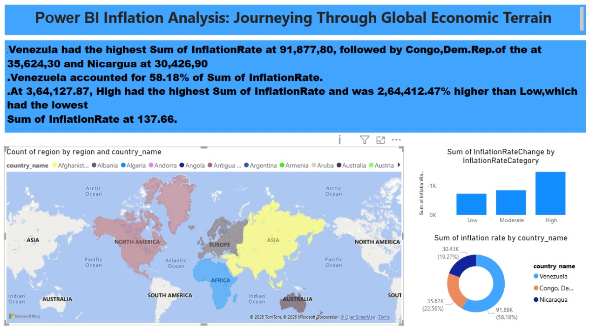

# PowerBI-Internship
Power BI Inflation Analysis: Journeying Through Global Economic Terrain
# Power BI Inflation Analysis: Journeying Through Global Economic Terrain

## Problem Statement

This dashboard helps the leverging Power BI's analytical prowess, we delve into inflation data to offer tailored recommendations aligned with each market's unique economic conditions. Through insightful visualizations and strategic recommendations, we aim to equip stakeholders with actionable insights for informed decision-making. The goal of this project, *"Power BI Inflation Analysis: Journeying Through Global Economic Terrain,"* is to develop an interactive dashboard that uses Power BI to visualize and analyze global inflation data. By consolidating data from multiple sources, the project aims to identify key inflation drivers, regional trends, and correlations, offering valuable insights for more effective economic forecasting and policy formulation.

Since, Inflation rates vary significantly across different countries and regions, making it challenging for businesses, policymakers, and economists to gain a clear understanding of the global economic landscape. Traditional methods of tracking and analyzing inflation often lack the depth and interactivity required for real-time decision-making.  

 Our deliverables include an interactive Power BI dashboard showcasing inflation trends and a comprehensive report summarizing analysis findings and recommendations.

### Steps followed 

- Step 1 : Collection of the dataset from kaggle website.
- Step 2 : Load data into Power BI Desktop, dataset is a csv files continents and global inflation data.
- Step 3 : Open power query editor & in view tab under Data preview section, check "column distribution", "column quality" & "column profile" options.
- Step 4 : Calculated custom columns was created such as adjusted inflation rate, inflation rate category some formulas used. 
          
        Adjustedinflationrate = global_inflation_data[Inflationrate]*.01

        InflationRateCategory = 
           IF('global_inflation_data'[Inflationrate] < 2, "Low", 
           IF(global_inflation_data[Inflationrate] < 5, "Moderate", "High"))

Snap of Custom Columns,

Snap_1

- Step 5 : In the report view, under the view tab, theme was selected.
- Step 6 : Since the project title inserted through text box *"Power BI Inflation Analysis: Journeying Through Global Economic Terrain,"* in the visualizations pane in report view. 
- Step 7 : Visual filters (Slicers) were added for "Country" field.
- Step 8 : Five card visuals were added to the canvas, one representing average inflation rate, maximum & minimum inflation rate, region count and inflation rate change by country.
- Step 9 : A bar chart was also added to the report design area representing Sum of Inflation Rate by Years.
- Step 10 : In the report view, under the insert tab, text boxes were added to the canvas, in this high, moderate, and low values of sum of inflation rate is written.
- Step 11 : New measure was created to find inflation rate change.

for creating new column following DAX expression was written;
       
    InflationRateChange = 
        VAR CurrentYear = MAX(global_inflation_data[Year]) 
        VAR CurrentInflationRate = CALCULATE(MAX('global_inflation_data'[Inflationrate]), ALL('global_inflation_data'), 'global_inflation_data'[Year] = CurrentYear) 
        VAR PreviousInflationRate = 
            CALCULATE(
                MAX('global_inflation_data'[Inflationrate]), 
                ALL('global_inflation_data'), 
                'global_inflation_data'[Year] = CurrentYear - 1
            ) 
        RETURN 
        IF(ISBLANK(PreviousInflationRate), BLANK(), (CurrentInflationRate - PreviousInflationRate) / PreviousInflationRate)

A card visual was used to represent Average Inflation Rate

A card visual was used to represent Maximum Inflation Rate

A card visual was used to represent Minimum Inflation Rate

A card visual was used to represent Maximum Inflation Rate

A card visual was used to represent Region Count

# Snapshot of Dashboard (Power BI Service)

 
# Snapshot of Dashboard (Power BI Service)

 
 # Report Snapshot (Power BI DESKTOP)

 

